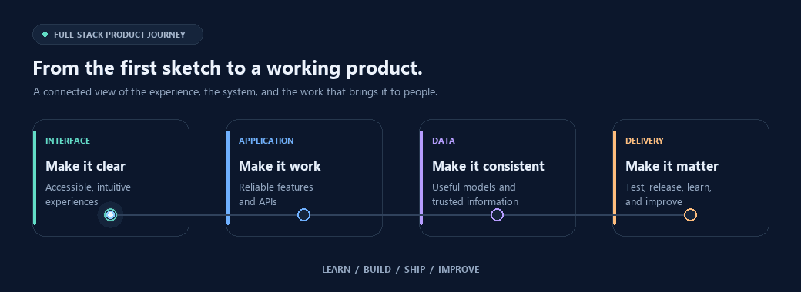

# Learning. Building. Shipping.

**A career is built one thoughtful step at a time.**

An animated snapshot of the developer journey: stay curious, build with care, and ship useful work.

## The craft behind the journey

- **Learn** — keep exploring ideas, tools, and better ways to solve problems.
- **Build** — turn curiosity into thoughtful, useful software.
- **Ship** — share the work, learn from what happens, and keep improving.

---

*Curiosity starts the journey. Consistent craft moves it forward.*
